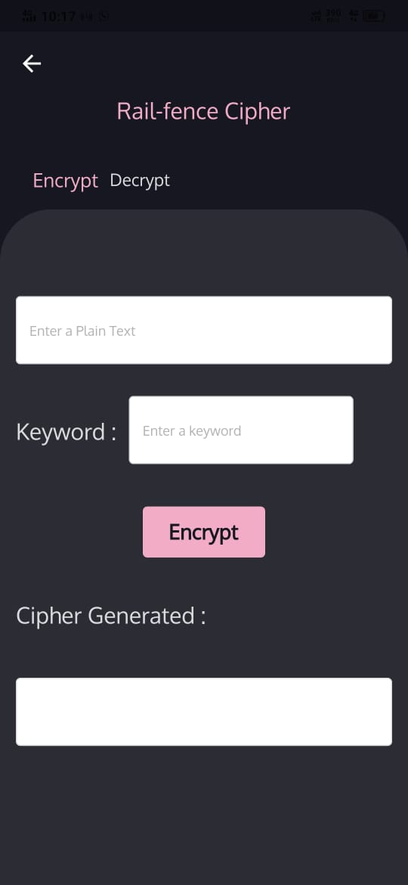

# Spyder Application

Spyder provides fast encryption and decryption techniques to conceal sensitive text data without external interruptions and decode the same.
At the moment only five cryptography techniques are used :
Caesar Cipher
Hill Cipher
Rail-fence Cipher
Vigenere Cipher
PlayFair Cipher

### Screenshots

   

## Usage

[Example] (https://github.com/amitgupta0220/SPYDER/blob/master/example/lib/main.dart)

To use this plugin :

* add the dependency to your [pubspec.yaml] (https://github.com/amitgupta0220/SPYDER/blob/master/example/pubspec.yaml) file.

```yaml
  dependencies:
  flutter:
    sdk: flutter
```

```
environment:
  sdk: ">=2.7.0 <3.0.0"
```
### Encryption, Decryption

```dart
  await Spyder.encryptUsingCaesarCipher(
                  _plainTextController.text.trim(), dropDownShift)
              .then((value) {
            setState(() {
              _decryptedTextController.text = value;
            });
            return null;
          });
          
   await Spyder.decryptUsingCaesarCipher(
                    _cipherTextController.text.trim(), dropDownShift)
                .then((value) {
              setState(() {
                _decryptedTextController.text = value;
              });
              return null;
            });
```

## iOS

### Alert: iOS implementation

This project is not implemented for ios yet.So wait for it or if you can contribute then please do help.

### Created & Maintained By

[Suyash Koltharkar](https://github.com/suyashhh)
[Amit Gupta](https://github.com/amitgupta0220)
[Hemil Patel](https://github.com/hemil-17)
    
# License

Copyright 2021 Amit Gupta

   Licensed under the Apache License, Version 2.0 (the "License");
   you may not use this file except in compliance with the License.
   You may obtain a copy of the License at

       http://www.apache.org/licenses/LICENSE-2.0

   Unless required by applicable law or agreed to in writing, software
   distributed under the License is distributed on an "AS IS" BASIS,
   WITHOUT WARRANTIES OR CONDITIONS OF ANY KIND, either express or implied.
   See the License for the specific language governing permissions and
   limitations under the License.


